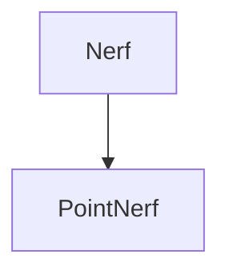

## Paper Graph

- **NeRF: Representing Scenes as Neural Radiance Fields for View Synthesis**. Ben Mildenhall, Pratul P. Srinivasan, Matthew Tancik, Jonathan T. Barron, Ravi Ramamoorthi, Ren Ng. **ECCV**.**2020.8** ([PDF](https://arxiv.org/pdf/2003.08934))([arXiv](https://arxiv.org/abs/2003.08934))(Citations)
    - present a method that achieves state-of-the-art results
for synthesizing novel views of complex scenes by optimizing an underlying continuous volumetric scene function using a sparse set of input
views.

- **Point Nerf**