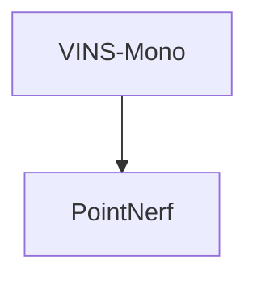

## Paper Graph

- **VINS-Mono: A Robust and Versatile Monocular Visual-Inertial State Estimator**. Tong Qin, Peiliang Li, and Shaojie Shen. **IEEE**.**2018.7** ([PDF](https://arxiv.org/pdf/1708.03852.pdf))([arXiv](https://arxiv.org/abs/2003.08934))(Citations:1902)
    - (a) Trajectory (blue) and feature locations (red)
    

## It’s NeRF From Nothing: Build A Complete NeRF with PyTorch
https://towardsdatascience.com/its-nerf-from-nothing-build-a-vanilla-nerf-with-pytorch-7846e4c45666

https://www.matthewtancik.com/

